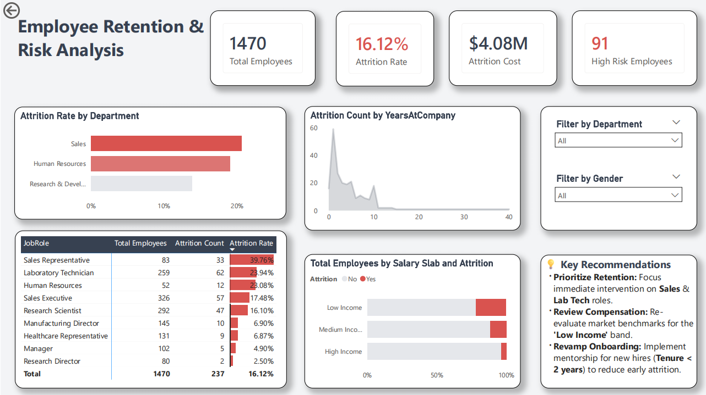

# 📊 Employee Attrition & Retention Dashboard

### 🚀 Project Overview
This Power BI dashboard analyzes employee attrition data to identify key trends, risk areas, and the financial impact of employee turnover. The goal was to provide HR managers with actionable insights to reduce the **16.12% attrition rate** and save on the estimated **$4M attrition cost**.

### 📸 Dashboard Preview

### 💡 Key Business Insights
* **The "2-Year Cliff":** 40% of all attrition occurs within the first 24 months of tenure.
* **High-Risk Departments:** Sales Representatives show the highest churn rate (39%), requiring immediate intervention.
* **Salary Impact:** Employees in the 'Low Income' slab are significantly more likely to leave compared to higher income bands.

### 🛠️ Technical Toolkit
* **Tool:** Microsoft Power BI
* **ETL:** Power Query (Data cleaning, conditional columns, age banding)
* **Modeling:** Star Schema & DAX Measures (Calculate Attrition Rate, Cost Impact)
* **Visualization:** Custom UI design with conditional formatting for "Risk Heatmaps."

### 🔄 Conclusion
The analysis recommends a **targeted mentorship program** for new hires (<2 years) and a **compensation review** for the Sales department to mitigate the $4M financial risk.
